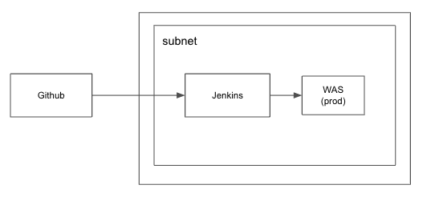

# Authorization Server use Jenkins

## Architecture



## Desc

- Jenkins를 사용한 CI/CD

## Jenkins

- DSL (./jobs/ci.groovy)
- Pipeline (./jobs/jenkinsfile)

```
    DSL은 젠킨스에서 파이프라인을 정의하기 위한 스트립트언어로 코드화된 버전을 제시함,
    다만, 세부적인 작동이나 특화된 방법을 사용하기 위해서는 인프라자동화, 서버 배포, 테스트 등의 대한 CI/CD는 파이프라인에서 작성하는게 더 편리함
```

## ...

- Nat Gateway 비싸다.. (Side Project에서는 안쓰는 걸로)
- VPC Endpoint를 사용하자.
