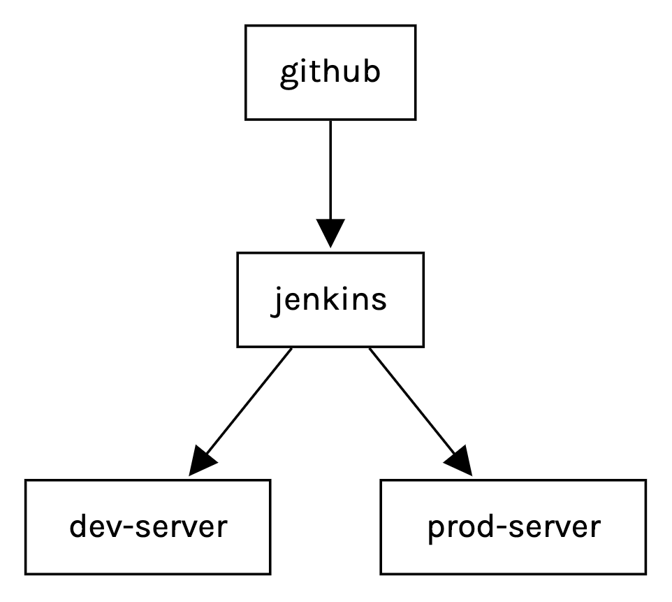
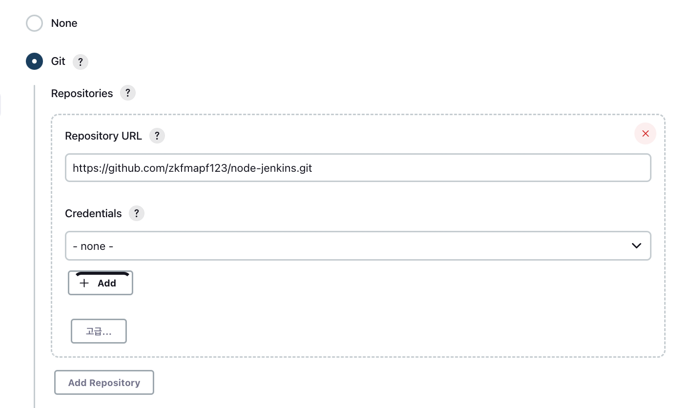
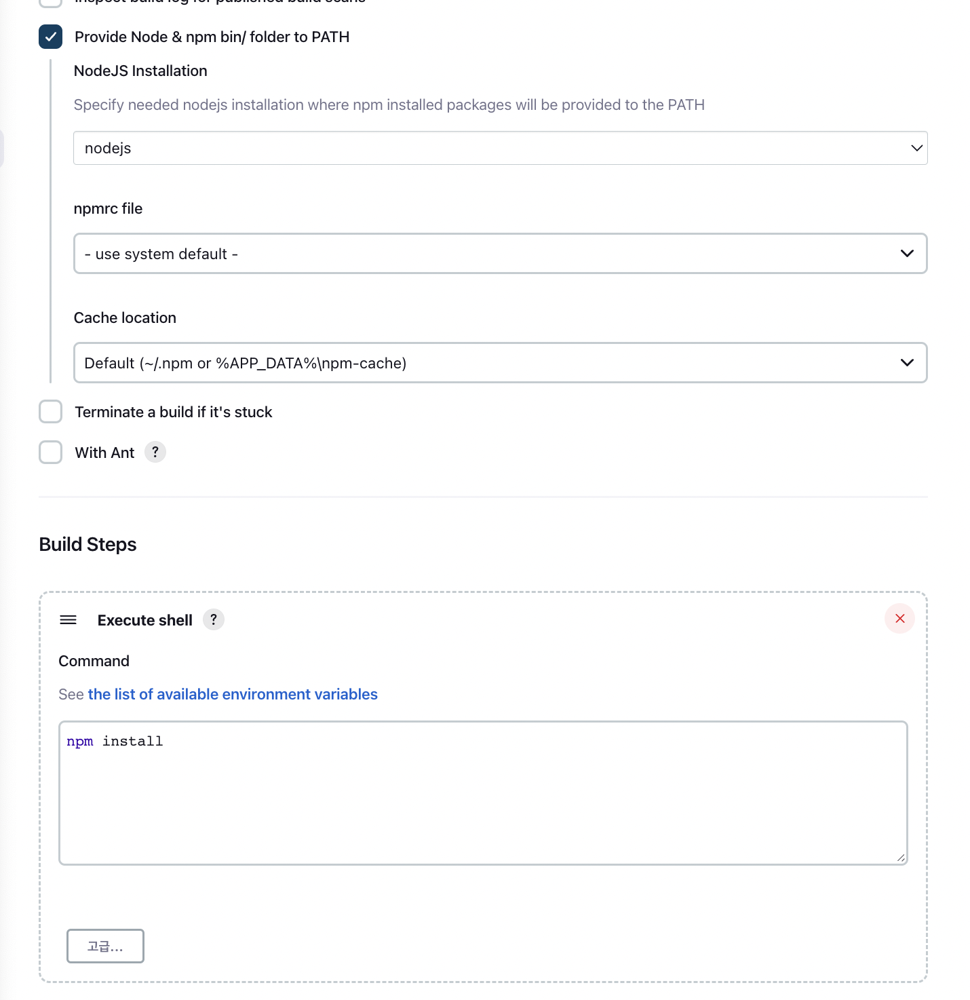
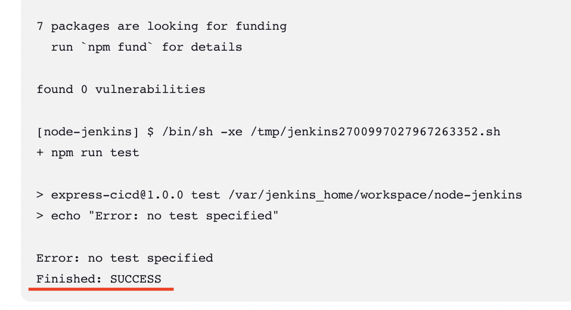
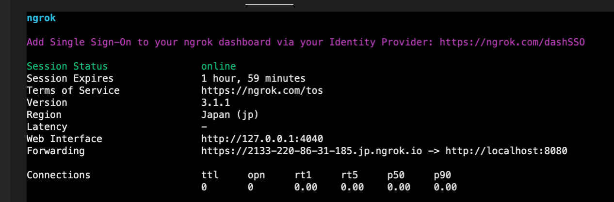
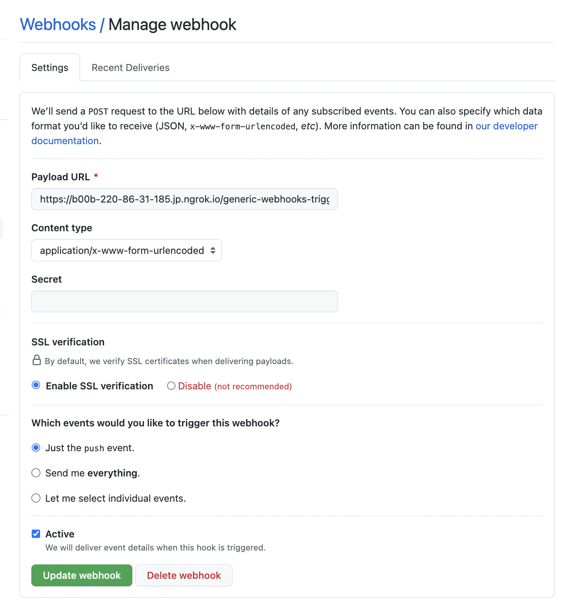

# Node-Jenkins Example

## Desc

- [ ] Upload Jenkins Server In Linux
- [ ] Manage Jenkins Server
- [ ] Deploy Dev Servier And Prod Server Another Linux Server

## Index

- [1. 서버 구조 만들기](#서버-구조-만들기)
- [2. jenkins 설정](#jenkins-설정)
- [3. github webhooks 설정하기](#github-webhooks)
- [4. dev, prod 배포하기](#dev-prod-배포)

## 서버 구조 만들기

> (DEV Server) -> PORT 3001 && (PROD Server) -> PORT 3000

- docker-compse up --build

> (Jenkins Server) -> PORT 4000

- docker pull jenkins/jenkins:lts
- docker run -u 0 -d --restart always --name jenkins-server -p 8080:8080 -p 50000:50000 -v /var/jenkins_home:/var/jenkins_home -v /var/run/docker.sock:/var/run/docker.sock jenkins/jenkins:lts

1. 수정된 프로젝트는 Github Merge 된다.
2. 머지된 Master 브랜치는 Github Webhooks를 이용하여 Jenkins에 요청한다. + Docker
3. jenkins는 Dev, Prod 서버에 각각 배포를 진행한다

## Jenkins 설정

- 1. Github URL 연결
- 2. 수동 Deploy 체크

- 간단한 위치

  - initialPassword 위치 > var/jenkins_home>secrets>initial...
  - workspace 위치 > var/jenkins_home/workspace/...

- Jenkins > plugin Management + Global Tool Configuration을 활용하여 필요한 plugins들을 설치한다
  - Node
  - Docker build and publish
- Create-Job > Configure > 소스코드 관리 + 빌드환경 + Build Step 정의
- Deploy -> Console output 에서 "Finished: SUCCESS" 확인
  
  
  

## Github WebHooks

- 1. 머지 될때마다 Jenkins WebHooks 보내기
- 2. GitHub Webook과 local의 네트워크 통신을 연결해야 하기 때문에 "ngrok" 사용

> ngrok 설치

- brew install --cask ngrok
- ngrok http [jenkins_port_number]
  - ex) ngork http 8080
    
- 주의사항
  - 세션 유지시간은 2시간
  - 해당 세션이 지나면 재시작해야 함 -> URL도 변경
  - 세션을 계속 연결하여야 한다면 인증토큰을 사용하여 세션시간에 제한을 받지 않도록 한다. (https://dashboard.ngrok.com/login)
  - ex) ngrok http 8080 --authtoken testAuthToken123123

> webhooks 설정

- settings > add webhooks
  
- [URL]/generic-webhooks-trigger/invoke?token=[GITHUB_TOKEN]
- GITHUB_TOKEN -> hooks 접근권한도 부여해야 함

## DEV, PROD 배포
